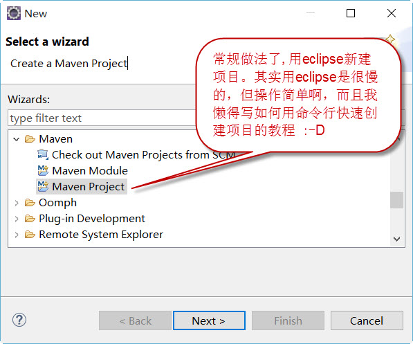
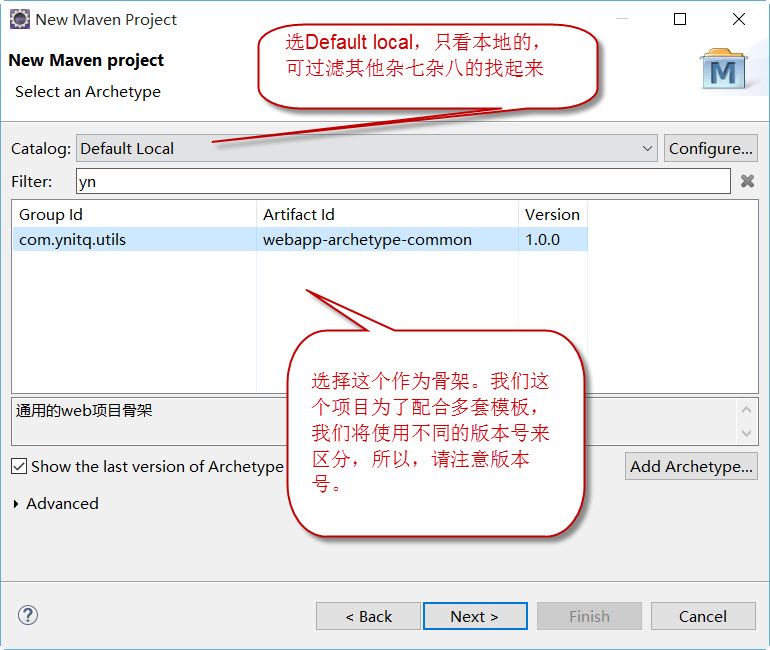
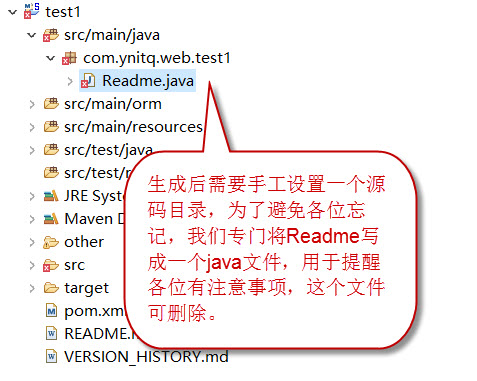

# 创建Web项目的模板

Maven模板的创建Web项目的模板实在是太旧了，居然还是Servlet 2.3的年代，创建项目后，修改起来还特别的麻烦。所以，这个项目就存在了。项目仍需完善，见[TODO](#todo)

## 如何使用
- 安装 
    先将项目克隆到本地。我们准备通过不同的分支来做不同的模板，所以，克隆后，请选择好你需要的分支，默认分支生成出来的项目是servlet3.0 + Spring4 + Hibernate3。

    切换好分支后，运行build.cmd，或者自己用命令行运行 

    ```sh
mvn install
    ```

    然后就完了，接下来我们就可以使用了。（简单吧，哈哈）

- 创建项目

    在上一步骤中，mvn install后，本地的仓库就有了这个archetype，我们就可以使用了，我们按平常创建maven项目的办法：

    

- 选择模板
    在选择的模板时候，选择我们自己做的模板就好了，如下图：

    

    搞定，收工，但第一次用得时候，会非常慢，请耐性等一下。该模板会已经配置好了web项目常用的依赖库，基本不用什么修改。

- 查看说明
    创建完成后，打开readme.md看一下注意事项就好。

    

## 项目原理

其实这种模板项目的原理超简单，运行时就是将 `src\main\resources\archetype-resources` 目录下的东西拷贝到生成的项目下。并且用模板引擎对文件名和文件内容处理一下，看相关问答，这个模板引擎应该是velocity，这个引擎是有脚本语言的，理论上我们可在文件中写模板引擎的语言的。

模板可使用的属性非常的少，其实就是我们新建项目的时候填写的几个属性，例如：

```
package=com.linzi.test
version=0.1.0-SNAPSHOT
groupId=com.linzi.web
artifactId=test1
```

## 配置文件

文件 `src\main\resources\META-INF\maven\archetype-metadata.xml` 描述了要拷贝的目录中，那些子目录是要用模板引擎解析的，那些要拷贝的，例如：

```xml
        <fileSet filtered="true" packaged="true" encoding="UTF-8">
            <directory>src/main/java</directory>
            <includes>
                <include>**/*.java</include>
            </includes>
        </fileSet>
```

这一段配置表示源码根目录`src\main\resources\archetype-resources` 下的`src/main/java` 这个目录要拷贝过去。

+ filtered=true 表示要用模板引擎解析目录下的文件
+ packaged=true 表示在该目录下建立空包结构目录

## 我们在这个项目中干了什么？

### 依赖库

加入了Spring+Hibernate的相关库，以及一些常用库，免得我们还有自己找半天。

+ 常用的Apache Common包
+ Spring MVC 
+ Hibernate
+ json
+ fastxml

### web.xml

+ 用Servlet 3.0的配置
+ spring的配置和例子

### spring配置文件
all.xml ，mvc配置等等

### hibernate例子
包括代码生成的模板、数据库配置、反向工程配置例子

### 空的项目目录结构
log4j配置以及log文件位置，xsd文件位置

## TODO
好吧，革命尚未成功，同志仍需努力，我们其实要需要完善一下的

+ ant build 的脚步
+ ant 根据 xsd 生成 java文件的脚步
+ ant 根据反向生成配置文件，从数据库生成java文件的脚本
+ 其他我们尚未想到的


